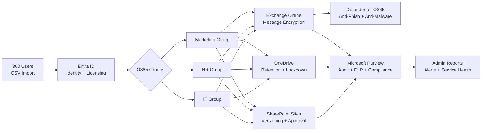

# Microsoft-365-enterprise-rollout

> Designed and deployed a secure-by-default M365 E3 environment for a 300-user mid-sized organization transitioning from on-prem collaboration to cloud-first.

**Stack:** Microsoft 365 E3 · Entra ID · Microsoft Defender · SharePoint Online · Exchange Online · OneDrive · Microsoft Purview · Viva Engage

---

## What It Does

- Provisions and licenses 300 users via bulk CSV import + scoped O365 Groups (IT, HR, Marketing)
- Enforces secure-by-default email + collaboration via Defender for O365, Message Encryption, transport rules
- Locks down data with SharePoint versioning, OneDrive retention (5-year), external-share restrictions
- Monitors tenant health via audit logs, alert policies, scheduled usage reports, service health alerts

---

## Architecture



---

## Tech Stack

| Layer | Tool |
|-------|------|
| Identity | Entra ID, Microsoft 365 Admin Center |
| Email Security | Microsoft Defender for Office 365, Exchange Online Protection |
| Collaboration | SharePoint Online, OneDrive for Business, Microsoft Teams, Viva Engage |
| Compliance | Microsoft Purview (Audit, DLP, Sensitivity Labels), Message Encryption |
| Monitoring | M365 Admin reports, Service Health, Alert Policies |
| Licensing | Microsoft 365 E3 |

---

## Implementation Steps

1. **Identity** - Bulk import 300 users via CSV → assign E3 licenses → configure profiles + org metadata
2. **Groups** - Create department O365 Groups (IT/HR/Marketing) → add users → scope SharePoint + Teams permissions
3. **Security** - Configure Defender baseline (anti-phish, anti-malware, Secure Score) → enforce Message Encryption via Exchange transport rules
4. **Collab** - Provision per-department SharePoint sites → enable versioning + content approval on HR libraries → restrict OneDrive external sharing → set 5-year retention
5. **Compliance** - Enable audit logging → create custom audit searches (SharePoint activity) → configure DLP policy notifications → restrict Viva Engage to internal-only
6. **Monitoring** - Schedule monthly usage reports → enable service health alerts → configure admin notifications

---

## E3 vs E5 - Architecture Decisions

Real licensing tradeoffs surfaced during build:

| Feature | E3 | E5 | Decision |
|---------|----|----|----------|
| Safe Links / Safe Attachments | ❌ | ✅ | Documented gap; mitigated via Defender baseline + user training |
| Advanced Alert Policies | ❌ (basic only) | ✅ | One basic alert configured; flagged for E5 upgrade evaluation |
| OneDrive 1-yr recycle + 5-yr retain (single policy) | ❌ | ✅ | Split into two policies as workaround |
| eDiscovery Premium | ❌ | ✅ | Standard eDiscovery sufficient for current scope |

**Takeaway:** E3 covers ~80% of secure collaboration. E5 = threat protection + advanced compliance. License selection is an architecture decision, not a sales upsell.

---

## What I Learned

- **Secure-by-default beats feature-rich-by-accident** - layered governance (identity → group → site → policy) prevents permission sprawl at scale
- **Transport rules > end-user encryption** - auto-encrypt outbound via Exchange beats relying on user behavior
- **Audit log retention is non-default** - must explicitly enable + configure custom searches; auditors expect this
- **License limits drive design** - E3 alert ceiling forced manual SharePoint activity tracking instead of automated incident response
- **Viva Engage internal-only is one toggle** - but the consequence (no external networks) shapes communication strategy across the org

---

## Future Work

- Migrate to E5 → enable Safe Links/Attachments + Defender for Endpoint integration
- Implement Conditional Access policies (require MFA, block legacy auth, location-based)
- Automate monthly reporting via Power Automate → Teams channel
- Layer Microsoft Sentinel for SIEM correlation across M365 + Azure signals

---

## Repository Structure

```
microsoft-365-enterprise-rollout/
├── README.md
├── docs/
│   ├── architecture.md
│   ├── e3-vs-e5-tradeoffs.md
│   └── governance.md
└── screenshots/
```

---

## Author

**Rajan Kumar** · Cloud / DevOps Engineer · Toronto, GTA
Open to Co-op (September 2026) · Authorized to work in Canada

- LinkedIn: [linkedin.com/in/imrajankumar95](https://linkedin.com/in/imrajankumar95)
- GitHub: [github.com/imrajankumar95](https://github.com/imrajankumar95)
