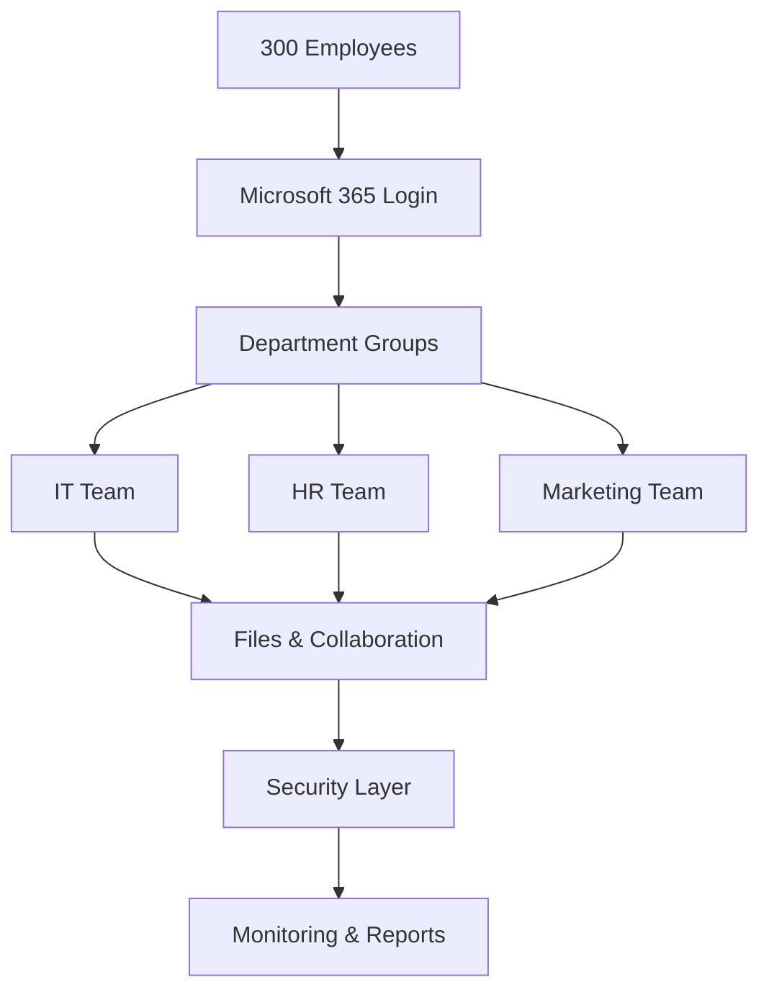

# Architecture

## The Big Picture

A 300-person company moved from old on-premise systems to Microsoft 365 in the cloud. This document explains how everything connects.

---

## How It Flows

---

## Layer-by-Layer Explained

### 1. People (Identity)
**What:** Every employee gets one login that works for email, files, chat, and meetings.
**How:** All 300 users imported in one go using a spreadsheet (CSV file). Each user is assigned a Microsoft 365 E3 license.
**Why it matters:** One login = less password fatigue, easier security, faster onboarding.

### 2. Teams (Groups)
**What:** Employees are grouped by department — IT, HR, Marketing.
**How:** Each group has its own permissions. HR can see HR files. Marketing can manage Teams. IT has admin rights.
**Why it matters:** Right people see the right things. No one accesses what they shouldn't.

### 3. Files & Collaboration
**What:** Everyone gets a shared workspace.
- **SharePoint** = department file libraries (like shared drives, but smarter)
- **OneDrive** = personal cloud storage
- **Teams** = chat, meetings, project rooms
- **Viva Engage** = company-wide social feed (internal only)

**Why it matters:** All work happens in one place. Files versioned. Nothing lost.

### 4. Security Layer
**What:** Built-in protection across every layer.
- Defender scans email for phishing/malware
- Sensitive emails auto-encrypted
- External file sharing blocked by default
- Audit logs track who did what

**Why it matters:** Stops attacks before users see them. Meets compliance requirements.

### 5. Monitoring & Reports
**What:** Dashboards showing who's using what + alerts when something goes wrong.
**Why it matters:** IT catches problems early. Leadership sees adoption trends.

---

## In One Sentence

Identity → Groups → Files → Security → Monitoring. Each layer protects the one below it.
