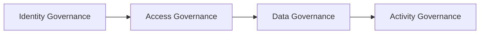

# Governance

## What Is Governance?

**Governance = the rules of the road.**

Who can do what. Who sees what. What happens to data over time. How the company stays compliant.

In a 300-user Microsoft 365 environment, governance is what stops chaos.

---

## The 4 Governance Pillars

---

## 1. Identity Governance — *Who Are You?*

**Goal:** Make sure only employees can log in.

**What was done:**
- Every user assigned a unique account in Entra ID
- Profile info (name, title, department) standardized
- Licenses assigned by department (not free-for-all)
- Old accounts disabled when employees leave

**Why it matters:** Stops former employees from accessing company data. Prevents random people from getting in.

---

## 2. Access Governance — *What Can You Do?*

**Goal:** Right people, right access, right reason.

**What was done:**
- Department groups (IT, HR, Marketing) with scoped permissions
- HR group → access to HR-only documents
- Marketing group → can manage Microsoft Teams
- IT group → admin rights, but logged
- Default = least privilege (start with nothing, grant only what's needed)

**Why it matters:** Marketing shouldn't see HR salary docs. Interns shouldn't have admin keys.

---

## 3. Data Governance — *Where Does Data Live?*

**Goal:** Data stays safe, retained correctly, deleted when it should be.

**What was done:**
- SharePoint sites with versioning (every edit = new version, can roll back)
- HR document libraries with content approval (changes need sign-off)
- OneDrive 5-year retention policy
- External sharing locked down (no random outsiders accessing files)
- Sensitive emails auto-encrypted via Exchange transport rules
- Sensitivity labels available for confidential docs

**Why it matters:** Regulators and auditors require data retention proof. Customers expect privacy. Lawsuits demand records.

---

## 4. Activity Governance — *What Happened?*

**Goal:** Full visibility into who did what, when.

**What was done:**
- Audit logging enabled across the tenant
- Custom audit searches built (e.g., SharePoint content changes)
- Alert policies for suspicious activity (failed logins, mass deletions)
- DLP (Data Loss Prevention) alerts when sensitive data moves
- Monthly usage reports auto-sent to IT leadership

**Why it matters:** When something goes wrong, IT needs to know what, when, and who. Without logs, investigation is impossible.

---

## Governance in Action — Real Examples

| Situation | Governance Response |
|-----------|---------------------|
| Employee leaves the company | Account disabled → license reassigned → data retained |
| HR needs to share a sensitive contract | Auto-encrypted email + sensitivity label applied |
| Marketing creates a new Team | Allowed (group permission) — IT auto-notified via report |
| Suspicious login attempt at 3 AM | Alert fires → IT investigates → access blocked if needed |
| Regulator audit request | Audit logs + retained data available within minutes |

---

## What I Learned

- Governance is **boring until something breaks** — then it's everything
- Set policies *before* users start working, not after
- Default-deny + explicit-allow > default-allow + reactive-block
- Document every decision — auditors and successors will thank you

---

## In One Sentence

Good governance is invisible when it works — and life-saving when it doesn't.
